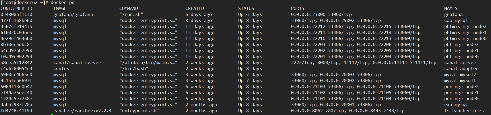
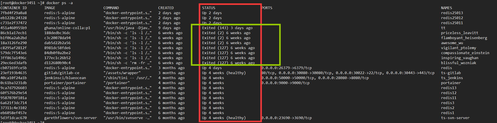

# Docker运维

## 基本概念

docker可以看作是一个虚拟机操作系统，类似vmware服务器版本。在其中运行的是容器（Container），每一个容器可以看做是一台虚拟机；每一个容器，有一个ID，做唯一标识，同时也可以指定一个名称。多个容器，可以通过使用同一个镜像（Image）来启动，这个类似与虚拟机的模板。

------


## 容器状态检查

查看正在运行的Docker容器

```bash
# docker ps
```




查看全部的docker容器

```bash
# docker ps -a
```



图中，绿色的框表示，已经停止的容器。如果需要可以通过命令来启动

------


## 容器的创建

启动一个nginx容器，将80端口映射为7080，html目录映射/tmp/html

```bash
[root@docker62 ~]# docker run -d --name web-server -p 7080:80 -v /tmp/html:/usr/local/nginx/html nginx
5c89a8e609c0cee985bdc134fe60797d974555f06a6e96b062333aa385f2b256
[root@docker62 ~]# 
[root@docker62 ~]# docker ps | grep web
5c89a8e609c0  nginx  "nginx -g 'daemon of…"   18 seconds ago  Up 17 seconds 0.0.0.0:7080->80/tcp  web-server
[root@docker62 ~]# curl http://localhost:7080
<!DOCTYPE html>
<html>
<head>
<title>Welcome to nginx!</title>
<style>
    body {
        width: 35em;
        margin: 0 auto;
        font-family: Tahoma, Verdana, Arial, sans-serif;
    }
</style>
</head>
<body>
<h1>Welcome to nginx!</h1>
<p>If you see this page, the nginx web server is successfully installed and
working. Further configuration is required.</p>

<p>For online documentation and support please refer to
<a href="http://nginx.org/">nginx.org</a>.<br/>
Commercial support is available at
<a href="http://nginx.com/">nginx.com</a>.</p>

<p><em>Thank you for using nginx.</em></p>
</body>
</html>
[root@docker62 ~]#
```

*一般情况下，我们应急或者测试，才会手动去启动一个容器。大多数情况，会通过jenkins来创建一个容器，这样可以把容器的定义比较直观的保存下来。*

------


## 容器的启动与关闭

已经关闭的容器，在没有被删除的情况下，可以通过命令再次启动。

```bash
[root@docker62 ~]# docker start web-server
web-server
[root@docker62 ~]# docker ps -a | grep web
5c89a8e609c0        nginx                           "nginx -g 'daemon of…"   6 minutes ago       Up 13 seconds              0.0.0.0:7080->80/tcp                                      web-server
[root@docker62 ~]# docker stop web-server
web-server
[root@docker62 ~]# docker ps -a | grep web
5c89a8e609c0        nginx                           "nginx -g 'daemon of…"   6 minutes ago       Exited (0) 1 second ago                                                              web-server
```

* 启动容器

```bash
# docker start 容器名称或者容器ID
```

* 关闭容器

```bash
# docker start 容器名称或者容器ID
```

------


## 查看容器日志

可以查看运行容器的日志内容。

```bash
# docker logs 容器名称或者容器ID
[root@docker62 ~]# docker logs web-server
172.17.0.1 - - [07/Nov/2019:02:15:54 +0000] "GET / HTTP/1.1" 200 612 "-" "curl/7.29.0" "-"
```

* 持续查看日志内容，日志滚动

```bash
[root@docker62 ~]# docker logs -f web-server
172.17.0.1 - - [07/Nov/2019:02:15:54 +0000] "GET / HTTP/1.1" 200 612 "-" "curl/7.29.0" "-"
```

* 只查看最近10条日志

```bash
[root@docker62 ~]# docker logs --tail 10 web-server
```

一般来说，使用容器以后，应用不再将日志保存到单独的文件，而是输出到控制台（Console）。这时候，docker系统，会把控制台上的日志保存到一个日志文件中。

------


## 查看容器定义

可以通过命令查看容器的定义，但是不是非常直观

```bash
# docker inspect 容器名称或者容器ID
```

输出中，Config和Mounts部分，可以找到端口和目录的映射定义

--------


## 在容器中执行命令

可以进入docker执行命令

```bash
[root@docker62 ~]# docker exec -it web-server bash
root@5c89a8e609c0:/# ls -l
total 8
drwxr-xr-x   2 root root 4096 Aug 12 00:00 bin
drwxr-xr-x   2 root root    6 May 13 20:25 boot
drwxr-xr-x   5 root root  340 Nov  7 03:01 dev
drwxr-xr-x   1 root root   66 Nov  7 02:15 etc
drwxr-xr-x   2 root root    6 May 13 20:25 home
drwxr-xr-x   1 root root   56 Aug 15 21:22 lib
drwxr-xr-x   2 root root   34 Aug 12 00:00 lib64
drwxr-xr-x   2 root root    6 Aug 12 00:00 media
drwxr-xr-x   2 root root    6 Aug 12 00:00 mnt
drwxr-xr-x   2 root root    6 Aug 12 00:00 opt
dr-xr-xr-x 497 root root    0 Nov  7 03:01 proc
drwx------   2 root root   37 Aug 12 00:00 root
drwxr-xr-x   1 root root   23 Nov  7 03:01 run
drwxr-xr-x   2 root root 4096 Aug 12 00:00 sbin
drwxr-xr-x   2 root root    6 Aug 12 00:00 srv
dr-xr-xr-x  13 root root    0 Oct 29 06:25 sys
drwxrwxrwt   1 root root    6 Aug 15 21:22 tmp
drwxr-xr-x   1 root root   19 Aug 12 00:00 usr
drwxr-xr-x   1 root root   19 Aug 12 00:00 var
root@5c89a8e609c0:/# 
```


## 目录结构


## 配置参数


